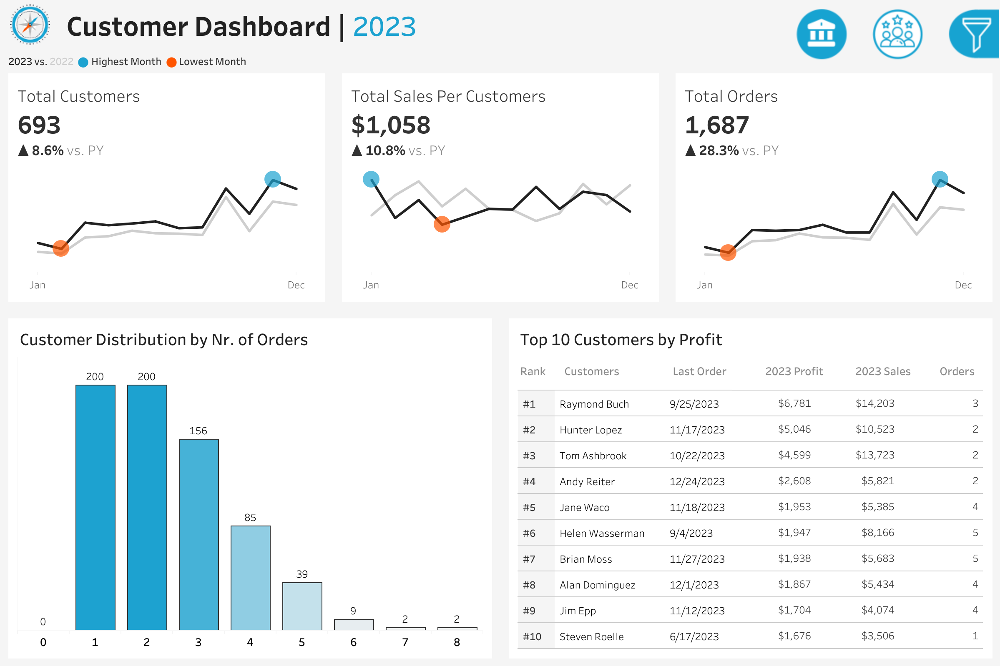
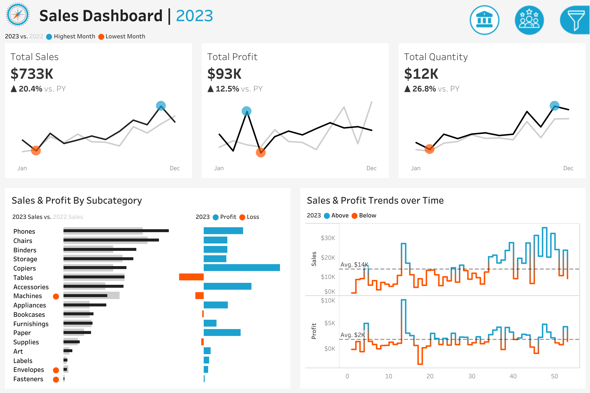

# 📊 Customer & Sales Analytics Dashboard using Tableau

## 📌 Project Overview

Understanding customer behavior and sales trends is crucial for improving business performance. This project focuses on **customer insights, sales trends, profitability analysis, and revenue optimization** using **SQL and interactive dashboards**.

Through **data-driven decision-making**, this project helps identify **top customers, high-revenue products, order trends, and sales growth opportunities**.

---
## 🔗 Live Dashboard Link
## [View Live Dashboard Here](https://public.tableau.com/app/profile/akshay.raj3847/viz/SalesCustomerDashboardsDynamic_17412449251960/SalesDashboard?publish=yes)

  
---
  

---
## 🛠️ Tech Stack Used

### 📊 Data Visualization & Reporting
- **Tableau** – Interactive dashboard visualizing **customer orders, sales trends, and profitability**.
- **Excel & CSV Processing** – **Data transformation and preprocessing** before SQL ingestion.

### 💾 Database & Query Processing
- **PostgreSQL / MySQL ** – **Relational database for structured sales data storage**.
- **SQL Queries** – Used for **customer segmentation, sales analysis, and order trend analysis**.

---

## 🚀 Business Problems Addressed

### 1️⃣ How has the number of customers and orders changed over time?  
Analyzing **customer growth and order trends** helps in understanding **business expansion**.

### 2️⃣ Which customers contribute the most profit?  
Identifying **high-value customers** helps in **customer retention and loyalty strategies**.

### 3️⃣ Which product categories generate the most revenue?  
Understanding **top-selling products** assists in **inventory planning and pricing strategies**.

### 4️⃣ How does sales performance vary across different months?  
Finding **seasonal trends** helps in **optimizing promotions and marketing campaigns**.

### 5️⃣ Which product categories result in losses despite high sales?  
Identifying **unprofitable products** helps in **cost control and price optimization**.

### 6️⃣ What are the trends in total sales and total profit?  
Analyzing **year-over-year revenue growth** helps in **financial forecasting**.

### 7️⃣ How do customers distribute across different order frequencies?  
Segmenting **customer purchasing behavior** helps in **personalized marketing efforts**.

### 8️⃣ What is the impact of high-spending customers on total revenue?  
Analyzing **customer contribution to revenue** helps in **customer relationship management (CRM)**.

### 9️⃣ How do total orders correlate with sales per customer?  
Understanding **customer spending behavior** helps in **cross-selling and upselling opportunities**.

### 🔟 Which months experience the highest and lowest sales?  
Detecting **high and low-performing months** helps in **seasonal promotions**.

---

## 📜 SQL Features Used
- **Joins & Subqueries** – **Merging customer, orders, and sales data** for in-depth insights.
- **Aggregations (SUM, COUNT, AVG, etc.)** – Computing **key sales metrics like total revenue, total orders, and average sales per customer**.
- **Window Functions (RANK, PARTITION BY, LAG)** – Identifying **top customers, revenue trends, and seasonality**.
- **Date & Time Functions** – Extracting **yearly, monthly, and quarterly trends**.
- **Filtering & Grouping** – Categorizing **customer segments and sales performance**.

---

### Dashboard Highlights

✅ **Total Customers:** 693 (⬆ 8.6% from previous year)  
✅ **Total Orders:** 1,687 (⬆ 28.3% from previous year)  
✅ **Total Sales Per Customer:** $1,058 (⬆ 10.8% from previous year)  
✅ **Total Sales:** $733K (⬆ 20.4% from previous year)  
✅ **Total Profit:** $93K (⬆ 12.5% from previous year)  
✅ **Total Quantity Sold:** 12K (⬆ 26.8% from previous year)  
✅ **Top Customers by Profit:** **Raymond Buch, Hunter Lopez, Tom Ashbrook**  
✅ **Top Revenue-Generating Products:** **Phones, Chairs, Binders**  

---

## 📂 SQL Files in This Project

### 1️⃣ EDA.sql – Exploratory Data Analysis  
- Analyzes **total orders, total sales, and customer purchasing trends**.  
- Identifies **top-selling products and high-revenue customers**.  
- Measures **sales growth and seasonality trends**.  

### 2️⃣ Summary_Stats.sql – Key Performance Metrics  
- Calculates **total revenue, profit margins, and average sales per customer**.  
- Analyzes **profitability trends by product category**.  
- Breaks down **monthly and yearly sales performance**.  

### 3️⃣ Advanced_Analysis.sql – Business Optimization Insights  
- Identifies **top customers contributing the most to revenue**.  
- Evaluates **underperforming product categories with high sales but low profit**.  
- Compares **customer order frequency and revenue per order**.  

### 4️⃣ Business_Problems.sql – Real-World Challenges & Solutions  
- Finds the **most profitable customers and products**.  
- Identifies **seasonal trends in sales and customer orders**.  
- Detects **low-profit product categories needing price optimization**.  
- Analyzes **the relationship between customer retention and sales growth**.  

### 5️⃣ Sales_Performance.sql – Revenue & Order Analysis  
- Ranks **top-performing product categories by sales and profit**.  
- Identifies **customers placing the most orders and contributing the highest revenue**.  
- Analyzes **monthly trends in total revenue and orders**.  
- Determines **customer segments with high vs. low purchasing frequency**.  

---

## 📈 Key SQL Insights

- **Repeat customers contribute significantly to total revenue**, but **most customers place only 1-2 orders**.  
- **Top-selling products like Phones and Chairs drive the highest revenue**, while **Machines and Accessories show losses**.  
- **Total sales and total orders peaked in December**, indicating strong **seasonal demand**.  
- **Total orders grew by 28.3% year-over-year**, showing **business expansion**.  
- **High-profit customers placed fewer but larger-value orders**, while **low-value customers placed multiple small orders**.  
- **Some product categories have high revenue but low profit margins**, requiring **pricing adjustments**.  

---

## 📝 Future Improvements

🚀 **Predictive analytics for future sales forecasting**  
📊 **Machine learning for customer segmentation and personalized recommendations**  
⚡ **Real-time dashboards with automated data updates**  
🔍 **Churn prediction analysis for customer retention strategies**  
💡 **Automated inventory optimization based on sales trends**  

---

## 🎯 Conclusion

The **Customer & Sales Analytics Dashboard & SQL Analysis** project provides **valuable insights into customer behavior and sales performance**.

By leveraging **SQL and visualization tools**, this project enables businesses to:
- Optimize **customer engagement and retention strategies**.
- Improve **sales performance and revenue growth**.
- Identify **high-performing and underperforming products**.
- Enhance **marketing and inventory planning**.

This analysis helps **business analysts, marketing teams, and sales strategists** make **data-driven decisions to maximize revenue and customer satisfaction**.

---

